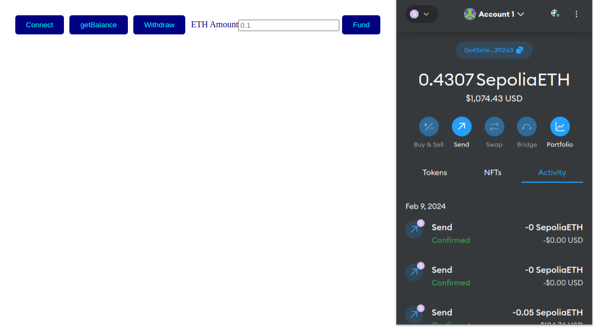

# Fund Me Smart Contract

[](LICENSE)




## Description

Welcome to My Fund Me Smart Contract! This repository contains the codebase for my Contract built in foundry with a simple frontend. Here you can connect your metamask wallet, see your balance and add funds to the contract!

## Table of Contents

- [Fund Me Smart Contract](#fund-me-smart-contract)
  - [Description](#description)
  - [Table of Contents](#table-of-contents)
  - [Technologies Used](#technologies-used)
  - [Features](#features)
  - [Installation](#installation)
  - [Contributing](#contributing)
  - [License](#license)
  - [Contact](#contact)


## Technologies Used

My Fund Me Contract is built using the following technologies:

- Solidity
- Foundry
- Anvil
- HTML
- CSS
- JavaScript

## Features

- Connect MetaMask wallet
- See Balance
- Add funds to contract
- Owner can withdrwal funds

## Installation

To set up the project locally, follow these steps:

1. Clone this repository to your local machine:

   ```bash
   git clone github.com/austinmargarone/portfolio.git
   ```
2. Navigate to the project directory:

   ```bash
   cd Fund_Me_Contract
   ```

3. Build the necessary dependencies:

   ```bash
    forge build
   ```

4. Start anvil:

   ```bash
    anvil
   ```

4. Start the script:

    ```bash
    forge script script/Counter.s.sol:CounterScript --rpc-url <your_rpc_url> --private-key <your_private_key>
   ```

5. Open the HTML file on browser:


## Contributing

We welcome contributions from the community! To contribute to the project, follow these steps:

1. Fork this repository.
2. Create a new branch (`git checkout -b feature/your-feature-name`).
3. Make your changes and commit them (`git commit -am 'Add new feature'`).
4. Push to the branch (`git push origin feature/your-feature-name`).
5. Create a new Pull Request.

Please review our [Contributing Guidelines](CONTRIBUTING.md) for more details.

## License

This project is licensed under the [MIT License](LICENSE).


## Contact

For questions or support, please contact Austin Margarone at austin@margarone.dev.